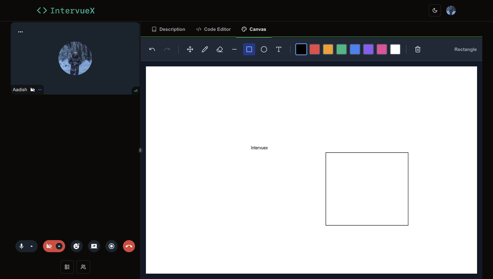

<h1 align="center">Intervuex</h1>

<p align="center">
  A full-featured video-calling platform for conducting technical interviews — built with Next.js, Stream, Convex, and Clerk.
</p>

Intervuex brings the entire technical-interview workflow into a single browser tab. Interviewers can schedule and run live video interviews with screen sharing and recording, pose questions from a built-in problem bank or their own custom problems, watch the candidate solve them in a **real-time collaborative code editor**, sketch ideas together on a **shared canvas**, run the candidate's code against a live execution engine, and leave structured ratings and feedback afterward. Candidates get a focused, distraction-free environment with a Monaco-powered editor, multi-language support, and instant code execution.

## Website

https://intervuex.aadishjain.dev/

## Features

1. **Role-Based Experience**: On first sign-in, users choose a role — **Candidate** or **Interviewer** — and get a tailored dashboard and permissions for each.
2. **Live Video Interviews**: HD video calls powered by Stream, with **screen sharing**, **screen recording**, and a participant grid (plus a mobile-friendly video carousel).
3. **Interview Scheduling**: Interviewers schedule interviews with a date/time picker, assign candidates and co-interviewers, and track status (upcoming, live, completed).
4. **Real-Time Collaborative Code Editor**: A Monaco editor whose code, language, and selected question stay in sync across all participants in real time via Convex.
5. **Multi-Language Code Execution**: Run candidate code directly in the browser through a server-side `/api/run` route backed by the **Wandbox** API — supports JavaScript, TypeScript, Python, Java, C++, and Go.
6. **Custom Coding Problems**: Interviewers can author their own problems (description, examples, constraints) on top of the built-in question set.
7. **Shared Whiteboard / Canvas**: A collaborative drawing canvas for system-design discussions and diagramming, synced live across participants.
8. **Interview Feedback & Ratings**: After a call, interviewers leave comments and a numeric rating tied to the interview for later review.
9. **Recordings**: Past interview recordings are listed and replayable from a dedicated recordings page.
10. **Authentication & Authorization**: Secure auth via Clerk, integrated with Convex through JWT-based identity so backend functions enforce per-user access.
11. **Theming & Responsive UI**: Light/dark mode, Tailwind CSS, and shadcn/Radix components, with layouts tuned for both desktop and mobile.

## Tech Stack

- **Framework**: Next.js 14 (App Router) with React 18 and TypeScript
- **Real-Time Backend & Database**: Convex (reactive queries, mutations, and live document sync)
- **Authentication**: Clerk (with Convex JWT integration)
- **Video / Audio / Recording**: Stream (`@stream-io/video-react-sdk` + `@stream-io/node-sdk`)
- **Code Editor**: Monaco (`@monaco-editor/react`)
- **Code Execution**: Wandbox public API via a Next.js Route Handler
- **Styling**: Tailwind CSS, shadcn/ui, Radix UI primitives, `lucide-react` icons
- **Utilities**: `date-fns`, `react-hot-toast`, `react-resizable-panels`, `next-themes`

## Project Structure

A single Next.js app combining the frontend and serverless API, with Convex as the real-time backend:

- **src/app/**: App Router routes.
  - **(root)/(home)/**: Role-aware home dashboard for candidates and interviewers.
  - **(root)/schedule/**: Interview scheduling UI.
  - **(root)/meeting/[id]/**: The live interview room (video, code editor, canvas).
  - **(root)/recordings/**: List and playback of past recordings.
  - **(admin)/dashboard/**: Admin overview.
  - **api/run/**: Server route that executes submitted code via Wandbox.
  - **canvas/**: Standalone collaborative canvas route.
- **src/components/**: UI building blocks — `MeetingRoom`, `MeetingSetup`, `CodeEditor`, `canvas`, `Navbar`, `ScheduleInterviewDialog`, `CreateProblemDialog`, `CommentDialog`, `RoleChooser`, and the shared shadcn `ui/` primitives. `providers/` holds the Convex + Clerk provider.
- **convex/**: Real-time backend.
  - **schema.ts**: Tables — `users`, `interviews`, `comments`, `codeStates`, `customProblems`, `canvasStates`.
  - **interviews.ts / users.ts / comments.ts / code.ts / customProblems.ts / canvas.ts**: Queries and mutations.
  - **auth.config.ts**: Clerk JWT issuer config (per deployment).
  - **http.ts**: Webhooks / HTTP actions.

## Pages

### 1. Candidate Home Page


### 2. Interviewer Home Page


### 3. Interview Home Screen


### 4. Meeting Preview


### 5. Code Editor


### 6. Custom Coding Problems


### 7. Canvas



## Getting Started

### Prerequisites

1. **Node.js** (v18.18 or higher)
2. A **Convex** account ([convex.dev](https://convex.dev))
3. A **Clerk** account ([clerk.com](https://clerk.com))
4. A **Stream** account ([getstream.io](https://getstream.io))

### Installation

1. **Clone the repository**:
    ```bash
    git clone https://github.com/aadishj23/intervuex.git
    cd intervuex
    ```

2. **Install dependencies**:
    ```bash
    npm install
    ```

3. **Configure environment variables**:
    - Copy the template and fill in real values:
      ```bash
      cp .env.example .env.local
      ```
    - | Variable | Description |
      | --- | --- |
      | `NEXT_PUBLIC_CLERK_PUBLISHABLE_KEY` | Clerk publishable key |
      | `CLERK_SECRET_KEY` | Clerk secret key |
      | `CONVEX_DEPLOYMENT` | Convex deployment identifier |
      | `NEXT_PUBLIC_CONVEX_URL` | Convex deployment URL |
      | `NEXT_PUBLIC_STREAM_API_KEY` | Stream API key |
      | `STREAM_SECRET_KEY` | Stream secret key |

4. **Configure Clerk ↔ Convex auth**:
    - In Clerk, create a **JWT template** named `convex`.
    - Set the issuer domain on **each** Convex deployment so it trusts your Clerk instance's tokens:
      ```bash
      npx convex env set CLERK_JWT_ISSUER_DOMAIN https://<your-instance>.clerk.accounts.dev
      ```
      Use your Clerk **Frontend API** / issuer URL here (dev and prod each get their own value).

5. **Start Convex** (in a separate terminal — pushes schema and functions):
    ```bash
    npx convex dev
    ```

6. **Run the application**:
    ```bash
    npm run dev      # development → http://localhost:3000
    npm run build    # production build
    npm run start    # serve the production build
    ```

7. **Access the application**:
    - Open a browser and go to `http://localhost:3000`.

> **Note on code execution:** the `/api/run` route uses the free public [Wandbox](https://wandbox.org/) API and needs no key. For production interview load, point `WANDBOX_URL` at a self-hosted Wandbox or swap in a self-hosted Piston/Judge0 instance.

## Usage

1. **Sign Up & Choose a Role**: Create an account and pick **Candidate** or **Interviewer**.
2. **Schedule an Interview** (Interviewer): Set a title, time, candidate, and co-interviewers.
3. **Join the Meeting Room**: Preview camera/mic, then enter the live room with video, screen share, and recording.
4. **Solve in the Code Editor**: Pick a built-in or custom problem, write code in any supported language, and **run** it for live output — all synced between participants in real time.
5. **Collaborate on the Canvas**: Sketch system designs and diagrams together on the shared whiteboard.
6. **Leave Feedback** (Interviewer): After the call, submit comments and a rating for the candidate.
7. **Review Recordings**: Revisit past interviews from the recordings page.

## Future Scope

- **AI Interview Assistant**: Auto-generate problem hints, evaluate solutions, and summarize candidate performance.
- **Self-Hosted Execution**: First-class support for self-hosted Piston/Judge0 for reliable, unlimited code execution.
- **Test-Case Runner**: Run candidate code against predefined test cases with pass/fail results.
- **Analytics Dashboard**: Aggregate interview metrics, ratings, and hiring-funnel insights.
- **Mobile App**: Native Android/iOS clients for on-the-go interviewing.

## Contributing

Contributions are welcome! Please open an issue or create a pull request for any enhancements, bug fixes, or new features.
